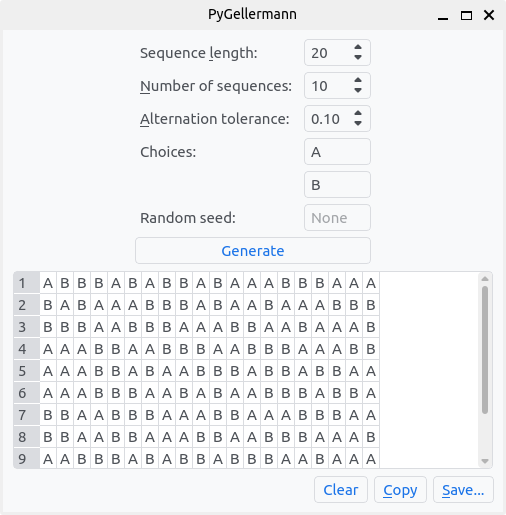

# PyGellerman: A Python Gellermann series generator

This is a Python implementation of a random genenerator for Gellermann series, pseudorandom binary sequence for human and non-human animal behavioural experiments[^Gellermann1933]. It includes both a graphical user interface (GUI) as well as a simple Python API.

## Installation
PyGellermann is available on PyPI and can be installed using pip:

    pip install pygellermann

For details on how to use `pip`, see the [Python Packaging User Guide](https://packaging.python.org/tutorials/installing-packages/) or [pip's User Guide](https://pip.pypa.io/en/stable/user_guide/).

Alternatively, you can download the GUI as a standalone executable from the [releases page](https://github.com/YannickJadoul/PyGellermann/releases).

## Usage
### Graphical User Interface
After installation, you can run the GUI by typing `pygellermann` in your terminal. The following window should appear:

Four parameters can be set to customize the generated Gellermann series:
- *Sequence length*: The length of each generated sequence.
- *Number of sequences*: The number of sequences to generate.
- *Alternation tolerance*: How close to 50% chance level a sequence needs to be when compared to single or double alternation.
- *Choices*: The two possible choices for each stimulus in the sequences.

The *Generate* button will then generate the requested number of sequences, and display them in the table underneath.

Finally, the generated Gellermann series can be copied to the clipboard (*Copy*) or saved to a CSV file (*Save...*).

### Python API

## License

PyGellermann is released under the GNU General Public License, version 3 or later. See the LICENSE file for details.

## References

[^Gellermann1933]: Gellermann, L. W. (1933). Chance orders of alternating stimuli in visual discrimination experiments. *The journal of genetic psychology, 42*, 206-208.
